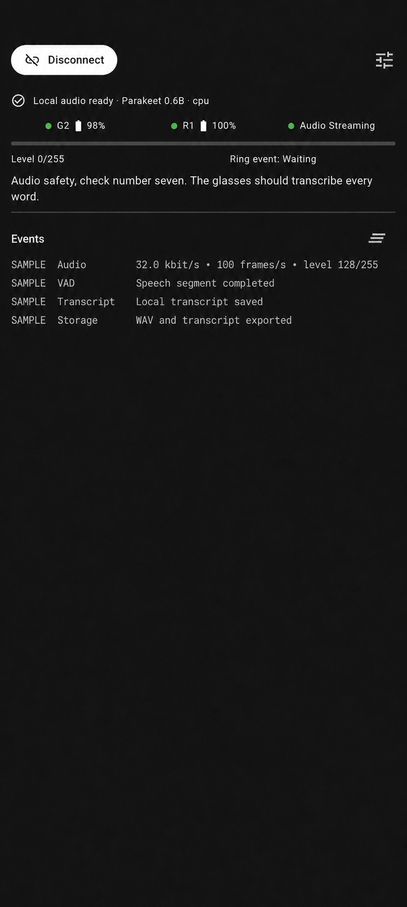

<h1>
  
  Work Bench
</h1>

<p align="center">
  
</p>

<p align="center">
  <em>Physical G2 audio → NNAPI-backed Parakeet 0.6B transcription test. System chrome was removed and event times were replaced with SAMPLE.</em>
</p>

Work Bench is a local-first wearable work agent built around the Even
Realities G2 glasses and R1 ring.

## Project goal

The goal is to turn continuous G2 audio and intentional R1 gestures into a
hands-free interface for managing technical work. An on-device, local-first
mobile agent interprets requests, maintains task context, asks for confirmation
when needed, and delegates well-scoped work to Claude Code or Codex terminal
sessions running on the user's computer. Progress, questions, and results can
then return to the glasses, with the ring providing discreet approval and
navigation.

```text
G2 audio + R1 gestures
          ↓
Work Bench mobile agent
          ↓
Authenticated local computer bridge
          ↓
Claude Code / Codex terminal workers
          ↓
Status, questions, and approvals on G2 + R1
```

This repository combines the hardware foundation already needed for that
vision: low-level dual-lens G2 BLE, R1 connectivity and gesture research,
continuous LC3 audio, durable local capture, VAD, on-device transcription,
on-glasses feedback, background operation, reconnect and Hub-page recovery,
raw diagnostics, and the documented firmware limitations. Intent processing,
the computer bridge, and terminal delegation are the next product layers.

Here, **local-first** means the wearable connections, session control, desktop
bridge, and owned context stay on the user's devices. Claude Code or Codex may
still use whichever hosted model services the user configures.

## Hub soft-kiosk goal

This build keeps a custom EvenHub page active with continuous microphone
streaming. The page starts without text, shows a voice-responsive waveform,
and displays R1 gestures beneath it.

It is a best-effort **soft kiosk**, not a firmware-level locked mode. The app
can restore its page and audio stream after recoverable interruptions, but the
G2 operating system still owns the global Menu and other system surfaces.

## Limitations

| Requirement | Current result |
| --- | --- |
| Stay in Daily/Hub mode | Yes; `MODE_DAILY` is reasserted after connection |
| Start and maintain microphone streaming | Yes; starts automatically and restarts after recovery |
| Keep tap and double-tap from stopping audio | Yes; both are display-only events |
| Show tap, double-tap, and swipe | Yes |
| Show long press | Inferred from R1 activity and Hub lifecycle evidence |
| Receive real long-press down/up in Hub | No; available only in Terminal mode |
| Disable the native global Menu | No; firmware reserves hold for the Menu |
| Guarantee the Hub page never exits | No; native system UI has priority |
| Control R1 directly from the phone | Not exposed; tested management GATT did not emit gestures |
| Decode and transcribe G2 audio on iOS | Not yet; the native LC3 bridge is currently Android-only |
| Run indefinitely in the background | Android is best-effort; iOS cannot guarantee this |

The fundamental limitation is that Daily/Hub mode publishes tap, double-tap,
and swipe, while the G2 firmware consumes hold as the global Menu command.
Terminal mode exposes real hold start/stop events, but Terminal and an EvenHub
page cannot own the foreground simultaneously.

See the [hardware-verified Hub/Terminal long-press analysis](docs/G2_R1_HUB_LONG_PRESS.md)
for protocol traces, approaches tested, and what Even Realities would need to
expose for a true locked Hub mode.

## From hardware POC to work agent

| Layer | Status |
| --- | --- |
| G2/R1 discovery, connection, protocol, and diagnostics | Implemented |
| Continuous LC3 stream, waveform, gestures, and Hub recovery | Implemented |
| Android foreground operation and iOS background-central support | Implemented within platform limits |
| Durable LC3 capture, VAD, and selectable local Whisper/Parakeet STT | Implemented on Android |
| On-device intent, task context, and approval policy | Planned |
| Authenticated bridge to the user's computer | Planned |
| Claude Code and Codex terminal adapters | Planned |
| Glasses status, questions, approvals, cancellation, and results | Planned |

## Current hardware experience

- Connects both G2 lenses and an R1 ring.
- Starts raw 16 kHz mono LC3 streaming automatically.
- Journals compressed audio before decoding, saves VAD speech with a
  five-second pre-roll and one-second endpoint delay, and transcribes locally
  with a Tools-selectable local model. Parakeet 0.6B is the current default;
  Parakeet 110M and Tiny Whisper remain available.
- Lets Android users choose a shared device folder for Files-visible speech
  WAVs and text transcripts. Home's **Transcriptions** tab reads the saved text
  and plays its paired WAV directly from that folder while retaining the
  app-private durable capture path for recovery. It loads the newest 20 first
  and reveals more while scrolling.
- Draws a thin waveform in the upper-left using LC3 global gain and an adaptive
  silence floor.
- Displays `Tap`, `Double tap`, `Swipe up`, `Swipe down`, and
  `Long press (inferred)`.
- Shows one live audio summary plus concise connection, gesture, and lifecycle
  events without flooding the Home screen with raw packets.
- Keeps manual display commands and raw G2 diagnostics behind the upper-right
  **Tools** icon.
- Uses an Android foreground service and declares iOS
  `bluetooth-central` background support.
- Prevents screen sleep while the app is visible and preserves active BLE,
  reconnect, and LC3 work during temporary app switching.

## Run the current hardware POC

Use a physical phone with Bluetooth enabled:

```sh
git lfs install
git lfs pull --include='models/stt/**'
./tool/fetch_speech_models.sh
flutter build apk --debug
flutter install --debug
./tool/stage_android_stt_model.sh parakeet-0.6b
flutter run
```

The install step creates the app-private model directory; staging then places
the hash-verified default model there. The Parakeet weights are versioned with
Git LFS under `models/stt/`, but remain outside the APK. Stage
`parakeet-110m` the same way if it should appear as a usable lower-memory
choice in Tools. Tiny Whisper is bundled by `fetch_speech_models.sh`.

### Copy a Parakeet model to Android

Install Git LFS and materialize the model files after cloning:

```sh
git lfs install
git lfs pull --include='models/stt/**'
git lfs ls-files
```

The LFS checkout uses approximately 765 MiB. Files beginning with
`version https://git-lfs.github.com/spec/v1` are unresolved pointers, not
usable models; the staging tool detects and rejects them.

Install Work Bench on the phone before copying a Parakeet model. Android must
show the phone as `device`, not `unauthorized`:

```sh
adb devices
```

With one authorized Android device connected, copy the default larger model:

```sh
./tool/stage_android_stt_model.sh parakeet-0.6b
```

When multiple Android devices are connected, select the destination explicitly:

```sh
./tool/stage_android_stt_model.sh --device <android-serial> parakeet-0.6b
```

Use `parakeet-110m` instead of `parakeet-0.6b` to copy the lower-memory model:

```sh
./tool/stage_android_stt_model.sh --device <android-serial> parakeet-110m
```

The script first uses the selected LFS model under `models/stt/`, checks every
required file against the hashes pinned in the repository, and copies only
that model into the installed app's private
`files/workbench/models/<model-id>` directory. The model remains outside the
APK. `WORKBENCH_STT_MODEL_DIR` can explicitly select another hash-matching
source directory. Source archives that omit `models/stt/` fall back to the
official Sherpa-ONNX download cache.

Cold-start the app after staging so it can verify the copied files and create
its `.verified` markers:

```sh
adb -s <android-serial> shell am force-stop \
  dev.opensourceglasses.even_g2_r1_poc
adb -s <android-serial> shell monkey \
  -p dev.opensourceglasses.even_g2_r1_poc \
  -c android.intent.category.LAUNCHER 1
```

The Home status then reports the selected model and the qualified provider.
Work Bench reports STT and VAD separately under **Tools → Transcription**.
On Android API 29 or newer, each worker first tries the vendored arm64 NNAPI
runtime with NNAPI's reference-CPU device disabled. A silent warm-up profile
must show at least one node owned by `NnapiExecutionProvider`; otherwise that
model uses the explicit `cpu` provider. Session creation by itself is never
reported as GPU/NPU acceleration.

### Rebuild the arm64 NNAPI runtime

The APK uses the pinned local Flutter FFI package in
`third_party/sherpa_onnx_android_arm64_nnapi/`. It contains Sherpa-ONNX
`v1.13.4`, ONNX Runtime `1.27.0`, the small Sherpa patch that enables
hardware-only NNAPI registration, license files, and SHA-256 checksums.

To reproduce the native libraries, set `ANDROID_SDK` and `ANDROID_NDK` to
installed Android toolchains and put CMake 3.28 or newer on `PATH`, then run:

```sh
ANDROID_SDK=<android-sdk-directory> \
ANDROID_NDK=<android-ndk-directory> \
  ./tool/build_sherpa_nnapi_runtime.sh
```

The script checks out the pinned upstream revision in a fresh temporary
directory, rebuilds ONNX Runtime with its CPU and NNAPI providers, applies the
checked-in Sherpa patch, rebuilds the Android API 27 arm64 wrapper, and
refreshes the package manifest. Work Bench requires Android API 27; the
hardware-only NNAPI candidate is offered only on API 29 or newer.

This build does not contain an Android GPU execution provider or Qualcomm QNN.
NNAPI can choose a vendor NPU, DSP, or GPU only when the phone's NNAPI driver
supports the assigned graph partition. The current quantized Parakeet exports
contain dynamic-quantization operators that commonly prevent useful NNAPI
partitioning, so an individual phone may correctly report `cpu`.

If the app reports that Parakeet is not installed:

1. Confirm that Work Bench is already installed on the selected phone.
2. Confirm that `adb devices` reports the phone as `device`.
3. Rerun the staging command with the correct model and, when necessary,
   `--device <android-serial>`.
4. Cold-start the app. Reinstalling with replace/update semantics preserves the
   staged files, but uninstalling the app or clearing its storage removes them.

Then:

1. Grant Nearby Devices and notification permissions.
2. Under **Tools → Transcription → File storage**, tap **Choose folder** and
   approve the device folder that should receive WAV audio and text
   transcripts. Existing completed speech files are copied there, and future
   files are exported as they finish.
3. Return to Home and select **Transcriptions** to read the complete saved text
   or play its paired WAV. The list refreshes when this tab is selected and
   loads 20 entries at a time as you scroll. Select **Events** to see the 30
   most recent in-app events.
4. Tap **Connect devices**. Work Bench scans for the G2 pair and R1, connects
   them, and releases the temporary R1 setup link after Tri-Sync handoff.
5. Speak to move the waveform and use the ring to display gestures.
6. Tap **Disconnect** to reset the complete wearable connection.

Android's system folder picker gives Work Bench a persistent, scoped read/write
grant to only the selected folder; the app does not request broad storage
permission. The folder remains accessible through a file manager and to other
apps when the user gives those apps access to the same location. The grant can
be changed or cleared from the same setting, and clearing it does not delete
files already exported. Shared WAV and text files can contain sensitive
microphone content, so choose a folder whose access matches the intended
privacy boundary. The raw LC3 recovery journal, transcription ledger, and
model files remain in app-private storage and are never exposed through the
shared folder.

## More detail

- [Technical implementation details](docs/TECHNICAL_DETAILS.md) — G2/R1 BLE,
  LC3 analysis, background behavior, project map, and validation.
- [Local audio pipeline and recovery](docs/LOCAL_AUDIO_PIPELINE.md) — durable
  capture, VAD, transcription isolation, storage, acceleration, and failures.
- [Transcription and model test plan](docs/TRANSCRIPTION_TURN_TEST_PLAN.md) —
  physical Kokoro tests and matched-input STT comparison rules.
- [Hub/Terminal long-press analysis](docs/G2_R1_HUB_LONG_PRESS.md) — physical
  traces, firmware boundary, alternatives, and ruled-out approaches.
- [Implementation plan](docs/IMPLEMENTATION_PLAN.md) — MentraOS audit and
  delivery architecture.

Protocol details were ported from the MIT-licensed
[MentraOS](https://github.com/Mentra-Community/MentraOS) implementation. This
project is distributed under the [MIT license](LICENSE); third-party notices
are in [THIRD_PARTY_NOTICES.md](THIRD_PARTY_NOTICES.md).
